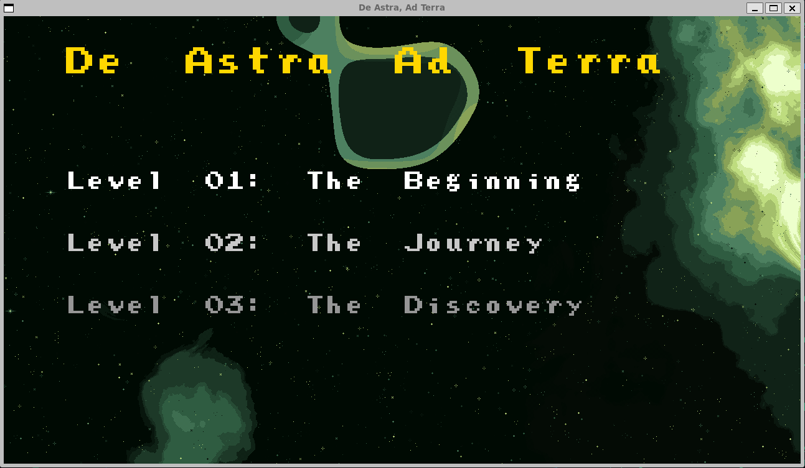
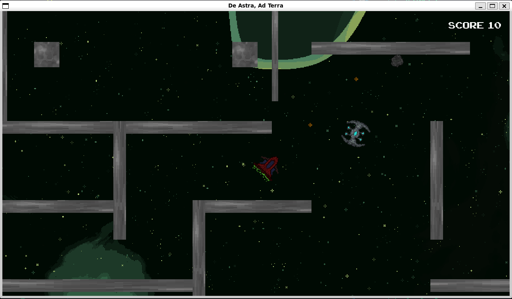
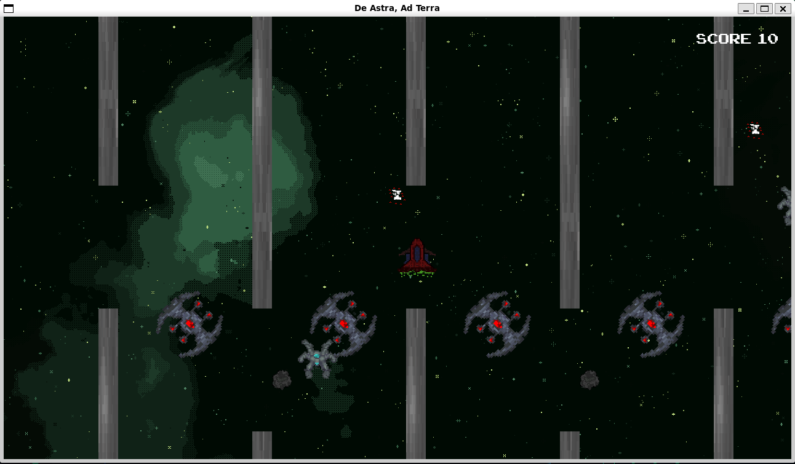
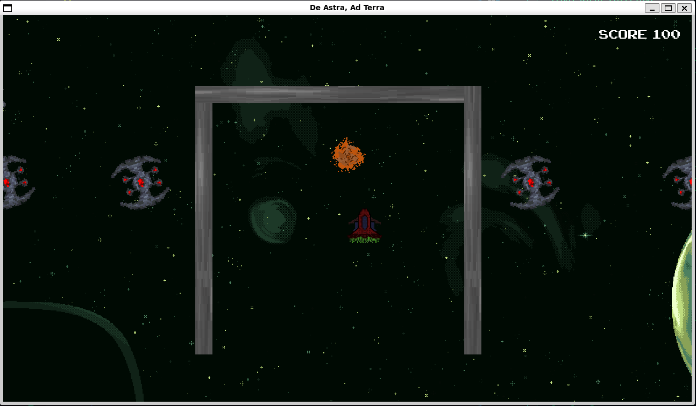
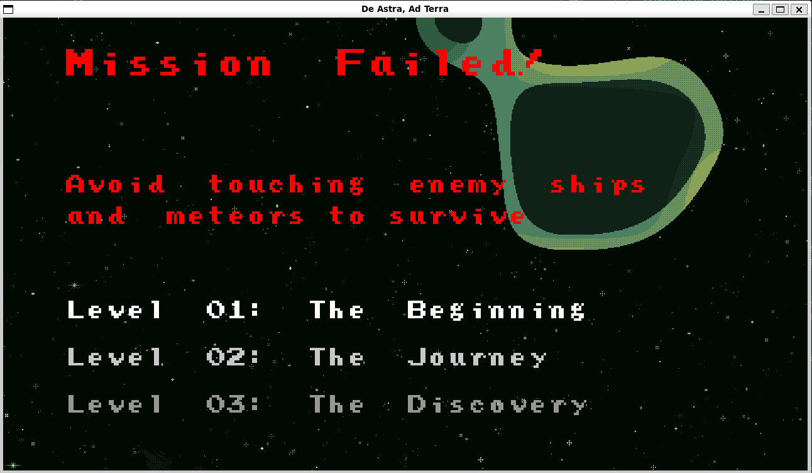
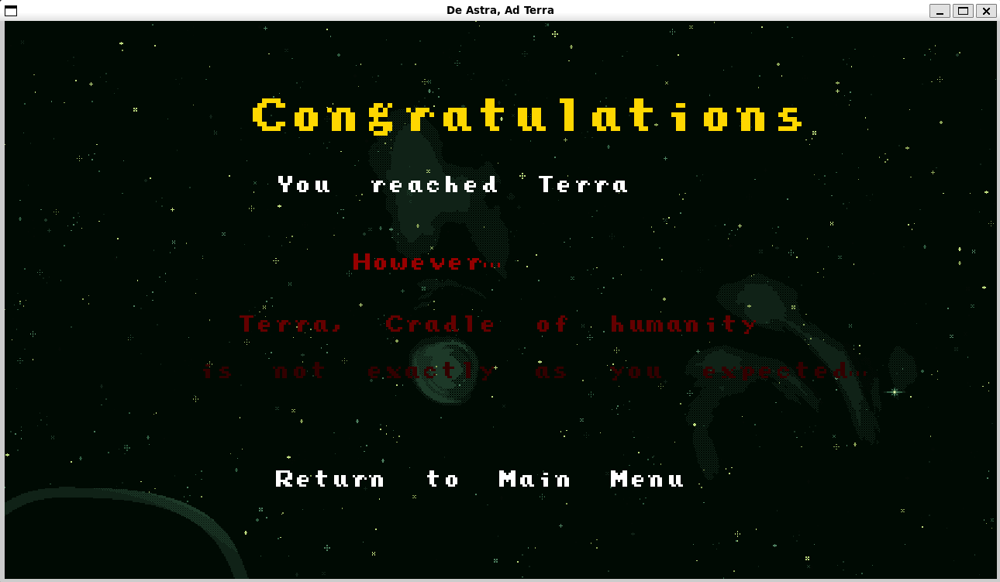
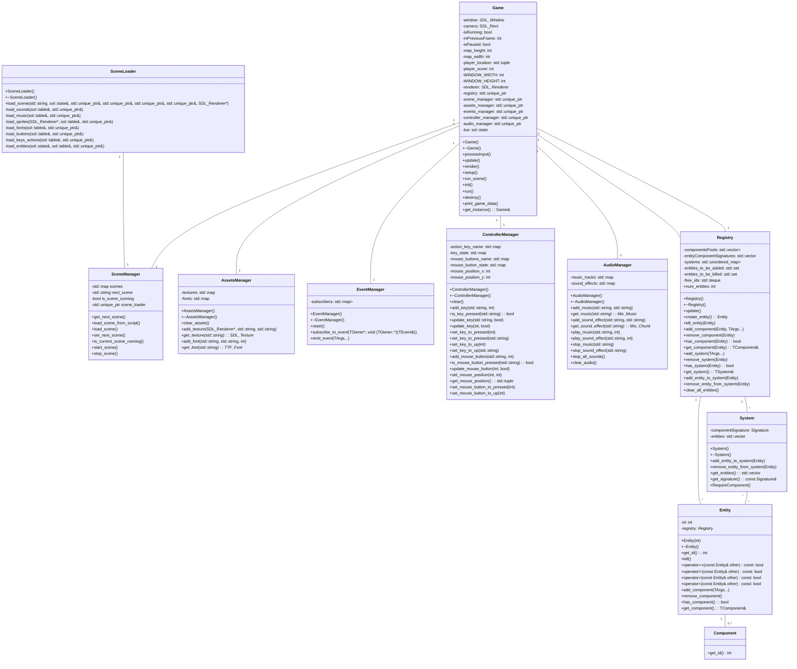

# Game development - De Astra Ad Terra :rocket:


## Game Description
This is a science fiction game where the player controls a spaceship that must avoid asteroids and enemy ships while shooting enemies.  
The game includes:  
- A main menu  
- An introduction screen providing context about the story  
- Three levels  
- A "death" screen displayed when the player dies, allowing redirection to any of the three levels  
- A "congratulation" screen that allows redirection to the main menu  

The game features background music and custom assets.  

## Controls
- **W**: Move the spaceship upward  
- **S**: Move the spaceship downward  
- **A**: Move the spaceship to the left  
- **D**: Move the spaceship to the right  
- **Space**: Shoot  
- **P**: Pause the game  

## Game Story
The game is set in a distant future where humanity has colonized other solar systems and galaxies. Over millennia, humanity has forgotten its origins and Earth, referred to as "Terra" in the game.  
After so much time, humans believe they have always lived in space, but a legend speaks of a small planet lost in the vastness of space—a planet that was humanity's origin, called "Terra."  

The player takes on the role of Captain Castellum. Upon discovering an ancient artifact in one of the colonies, the captain finds it to be a kind of map leading to a portal to "Terra." The captain decides to follow the map and uncover the truth about humanity's origins.  

After collecting the necessary artifacts, the captain reaches "Terra." The game ends with a "congratulation" screen, leaving the player wondering what the captain discovered on "Terra."  

## Game Objectives
To progress in the game, the player must:  
- Collect power-ups that increase movement speed. Narratively, these items represent ancient technologies that allow the ship to traverse portals to the next level.  
- Shoot enemies to achieve the highest score possible.  
- Avoid asteroids and enemy ships to stay alive.  
- Collect all necessary artifacts to advance to the next level.  

## Four Enemies
The game features four types of enemies:  
- **Asteroids**: Cannot be destroyed but can be avoided.  
- **Spider enemies**: Can be destroyed with one shot, awarding 10 points. They typically move slowly.  
- **Blue circular enemies**: Can be destroyed with one shot, awarding 15 points. They usually move faster than spider enemies and "roll."  
- **Red circular enemies**: Very large and cannot be destroyed.  

## Usage Guide
To compile the program, run the following command:  
```bash
make clean; make; make run
```  
The project was developed on Ubuntu 24.04 in WSL2 using the g++ 13.2.0 compiler.  

The Makefile was modified to work with my folder architecture.  

## Development Process
The game was developed using the engine provided in class, gradually adding the functionalities required for the assignment by following the available platform videos.  

Key modifications made to the engine include:  
- Adding an audio manager for background music and sound effects.  
- Adding new Lua bindings to load and play music and sound effects.  
- Fixing several bugs in the engine, such as a bug that failed to delete entities and components when changing scenes, which led to new entities inheriting components from the previous scene.  
- Adding a score system to track and display the player's score on the screen.  
- Implementing a shooting system that allows the player to shoot enemies infinitely, limited only by how fast they can press the spacebar.  
- Splitting the ECS file into several smaller files (component.hpp, entity.hpp, entity.cpp, system.hpp, and system.cpp) for better readability. The ECS.hpp file was modified to include these new files, without affecting engine functionality or runtime performance.  

Screenshots of the game in action are included below:  








## Installing Required Libraries
To install the necessary libraries on Linux, run the following command:  
```bash
sudo apt install libsdl2-dev libsdl2-image-dev libsdl2-ttf-dev libsdl2-mixer-dev lua5.3 liblua5.3-dev
```  

## Extra Points
To earn extra points, the following features were implemented:  
- [x] An audio manager to play background music and sound effects, using original audio by [Namlin](https://github.com/namlin).  
- [x] All graphic assets, except fonts and backgrounds, were created by [me](https://github.com/archibald-carrion) using [GIMP](https://www.gimp.org/).  

## Game Engine UML Diagram


## Resources used for the game
- [arcade classic font](https://www.1001fonts.com/arcadeclassic-font.html)
- [background generator](https://deep-fold.itch.io/space-background-generator)
- Music made by game developer [Namlin] (https://github.com/namlin)


## TODO
- [ ] Implement new scene introducing the characters after intro scene in some sort of "cinematic"